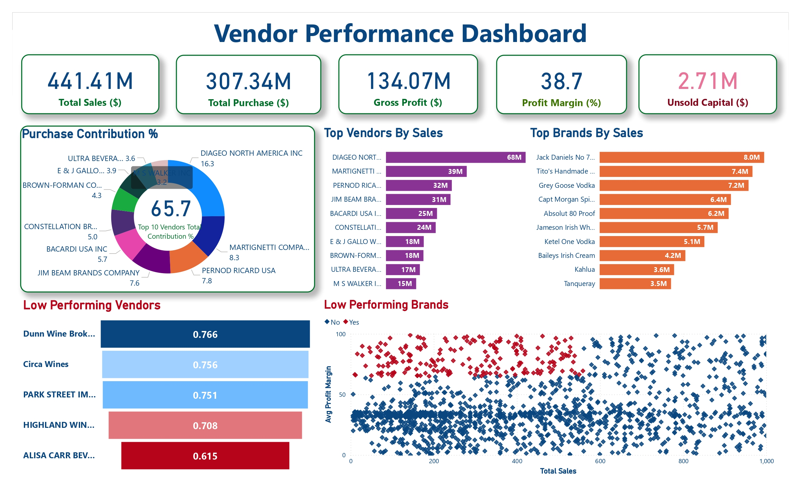

# vendor-performance-data-analysis
# Vendor Performance Data Analytics Project

## 📌 Project Overview
This project focuses on analyzing vendor performance using **SQL, Python, and Power BI**.  
The objective of this project is to understand vendor sales performance, purchase trends, freight costs, and overall business insights.

This is an **End-to-End Data Analytics Project** that includes:
- Data extraction using SQL
- Data cleaning and aggregation using Python
- Data visualization and reporting using Power BI

---

## 🛠 Tools & Technologies
- **SQL** – Data extraction and aggregation queries
- **Python** – Data analysis and processing
  - Pandas
  - NumPy
  - Matplotlib
  - Seaborn
- **Power BI** – Dashboard creation and business reporting

---

## 📊 Project Workflow
1. Data Collection
2. Data Cleaning using Python
3. Data Aggregation using SQL
4. Data Analysis using Pandas
5. Data Visualization using Power BI
6. Business Insights & Reporting

---

## 📈 Key Insights
- Vendor-wise sales performance
- Purchase vs Sales comparison
- Freight cost analysis
- Vendor profitability insights
- Identification of top performing vendors

---

## 📷 Dashboard Preview

---

## 📂 Project Files
- SQL queries for vendor sales analysis
- Python scripts for data cleaning and transformation
- Power BI dashboard for vendor performance visualization

---

## ⚠ Dataset
The dataset used in this project is larger than GitHub’s file size limit, so it is not included in this repository.

---

## 👨‍💻 Author

**Hrutik Maski**

MCA Student | Data Analytics Enthusiast

🔗 LinkedIn  
https://www.linkedin.com/in/hrutik-maski/
